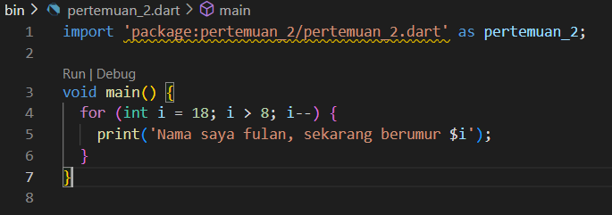
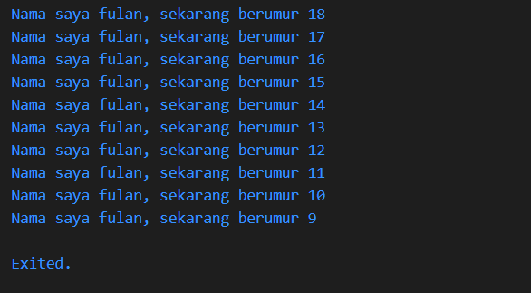

#
Nama    : Hilmy Zaky Mustakim

Kelas   : SIB-3E

NIM     : 2241760089
#

1. Modifikasilah kode pada baris 3 di VS Code atau Editor Code favorit Anda berikut ini agar mendapatkan keluaran (output) sesuai yang diminta!
 Jawaban :
 
 

2. Mengapa sangat penting untuk memahami bahasa pemrograman Dart sebelum kita menggunakan framework Flutter ? Jelaskan!
     Jawaban :
    Karena pengembangan framework Flutter menggunakan pengetahuan/fitur dengan bahasa Dart. Kode aplikasi, kode plugin, dan manajemen dependensi semuanya menggunakan bahasa Dart beserta fitur-fiturnya. Dengan memahami bahasa pemrograman Dart akan memudahkan untuk lebih produktif dan pengembangan lebih efektif dengan Flutter.

3. Rangkumlah materi dari codelab ini menjadi poin-poin penting yang dapat Anda gunakan untuk membantu proses pengembangan aplikasi mobile     menggunakan framework Flutter
  Jawaban  : 
    1. 